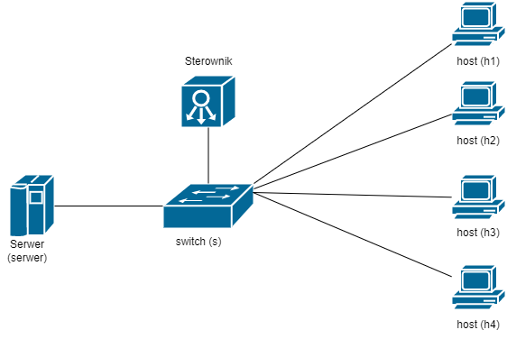
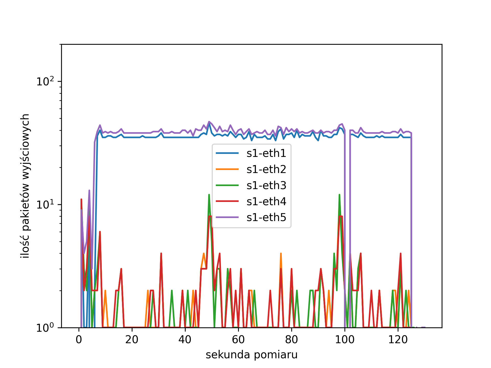
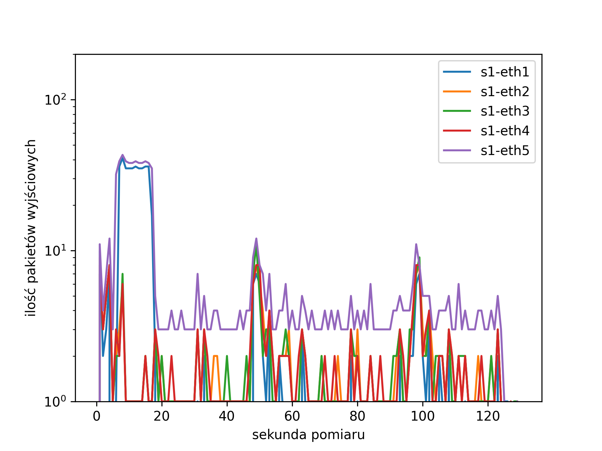

# Sieci Sterowane Programowo

Projekt ma na celu implementację mechanizmu obrony przeciwko atakowi DoS/DDoS z wykorzystaniem sterownika Floodlight.

## Zespół projektowy
* Kulig Sebastian
* Mirowska Diana
* Wnęk Karol


## Użyta topologia
Testowa sieć składa się z czterech hostów, które przeprowadzają atak, jednego serwera, na którym uruchomiono prosty serwer http. Całość jest połączona za pomocą jednego przełącznika komunikującego się z kontrolerem.


przygotowana topologia  znajduje się w pliku [custom_topology_raw.py](https://github.com/SebastianKulig/SDN/blob/main/custom_topology_raw.py)

## Schemat działania

Całość została podzielona na trzy moduły funkcjonalne:
1. Zbieranie statystyk z przełącznika - klasa `StatisticsCollector` w pakiecie `pl.edu.agh.kt`
2. Podjęcie decyzji o usunięciu/zachowaniu danego przepływu na podstawie uzyskanych wyników pomiarów - klasa .... Mechanizm decyzyjny zbudowany jest w oparciu o ....
3. Wdrożenie ustalonej strategii - klasa .... 

## Opis poszczególnych plików
* [floodlight/](https://github.com/SebastianKulig/SDN/tree/main/floodlight), katalog z plikami Floodlight bazujący na plikach źródłowych udostępnionych przez prowadzącego w ramach laboratorium nr 7
* [custom_topology.py](https://github.com/SebastianKulig/SDN/blob/main/custom_topology.py), skrypt uruchamiający topologię, przeprowadzający atak oraz zbierający dane pomiarowe
* [custom_topology_raw.py](https://github.com/SebastianKulig/SDN/blob/main/custom_topology_raw.py), plik zawierający jedynie topologię
* [plot_maker.py](https://github.com/SebastianKulig/SDN/blob/main/plot_maker.py), skrypt do wizualizacji wyników zwracanych przez custom_topology.py
* [SDN_final_presentation.pdf](https://github.com/SebastianKulig/SDN/blob/main/SDN_final_presentation.pdf), prezentacja końcowa 

## Sposób uruchomienia
* uruchomienie samej topologii i podłączenie się do kontrolera:
```bash
sudo mn --controller=remote,ip=127.0.0.1,port=6653 --custom ./custom_topology_raw.py --topo=custom
```
* uruchomienie głównego skryptu:
```bash
sudo python ./custom_topology.py
```
* wizualizacja wyników - wymagany [matplotlib](https://matplotlib.org) oraz [pandas](https://pandas.pydata.org), wynik zapisany jako `result.png`:
```bash
python3 ./plot_maker.py
```

## Przykładowy wynik
Sumaryczna ilość pakietów wejściowych do poszczególnych portów przełącznika z wyłączonym mechanizmem odrzucania ruchu:</br>


Ten sam scenariusz testowy, ale z progiem decyzyjnym ustalonym na wartość 300 pakietów na sekundę:


